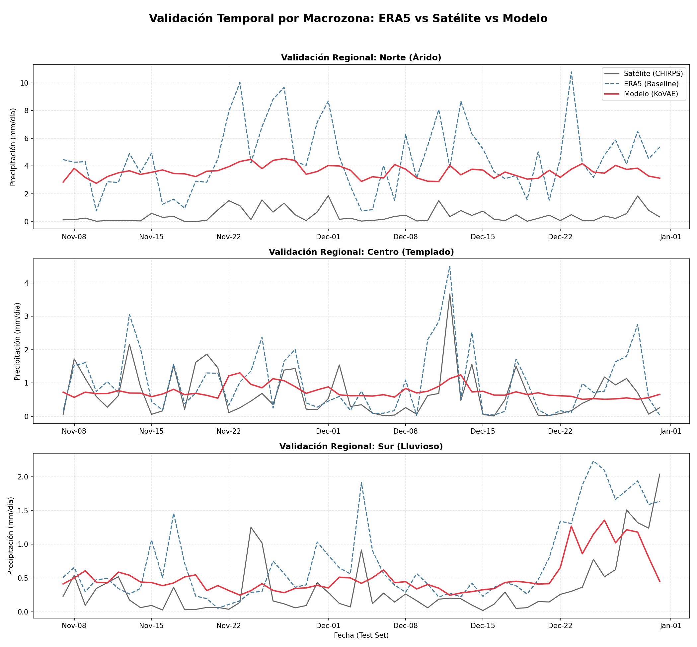
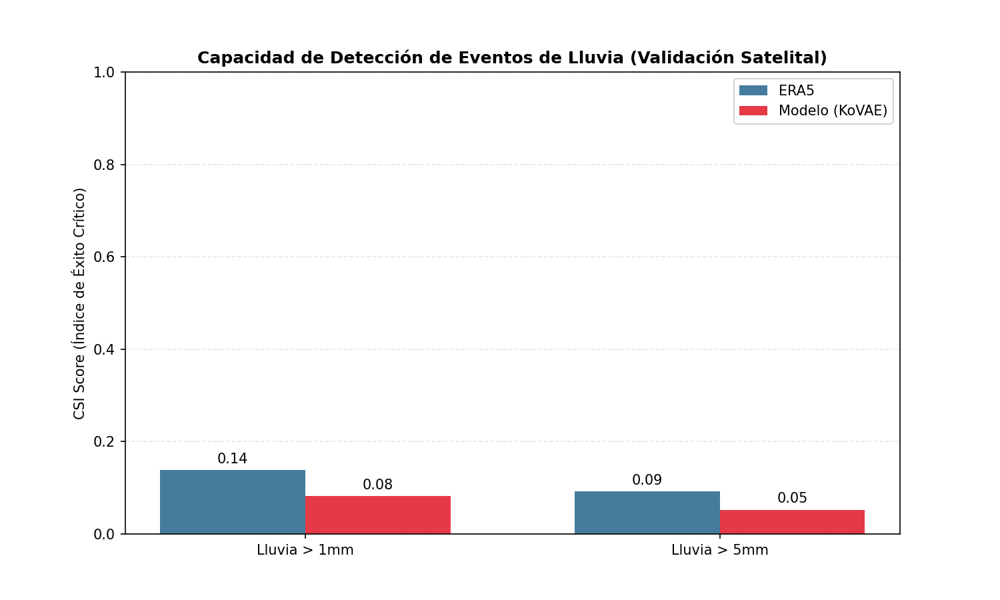

# Resumen de Validación Externa (CHIRPS)

Validación realizada contra datos satelitales CHIRPS (Ground Truth).

## 1. Métricas Globales (Promedio Nacional)
- **MAE Modelo:** 1.8622 mm/día
- **MAE ERA5:** 2.1115 mm/día
- **Mejora Global:** +0.2493 mm/día

## 2. Detección de Eventos (CSI Score)
### Eventos > 1 mm/día
- **ERA5 CSI:** 0.138
- **Modelo CSI:** 0.082
- *Nota: CSI mide aciertos penalizando falsas alarmas.*

### Eventos > 5 mm/día
- **ERA5 CSI:** 0.092
- **Modelo CSI:** 0.053
- *Nota: CSI mide aciertos penalizando falsas alarmas.*

## 3. Desempeño Regional (Error Absoluto)
| Zona | MAE ERA5 (mm) | MAE Modelo (mm) | Mejora |
|---|---|---|---|
| Norte | 4.148 | 3.141 | **+24.3%** |
| Centro | 0.467 | 0.579 | **-24.0%** |
| Sur | 0.463 | 0.332 | **+28.3%** |

## 4. Evidencia Gráfica

