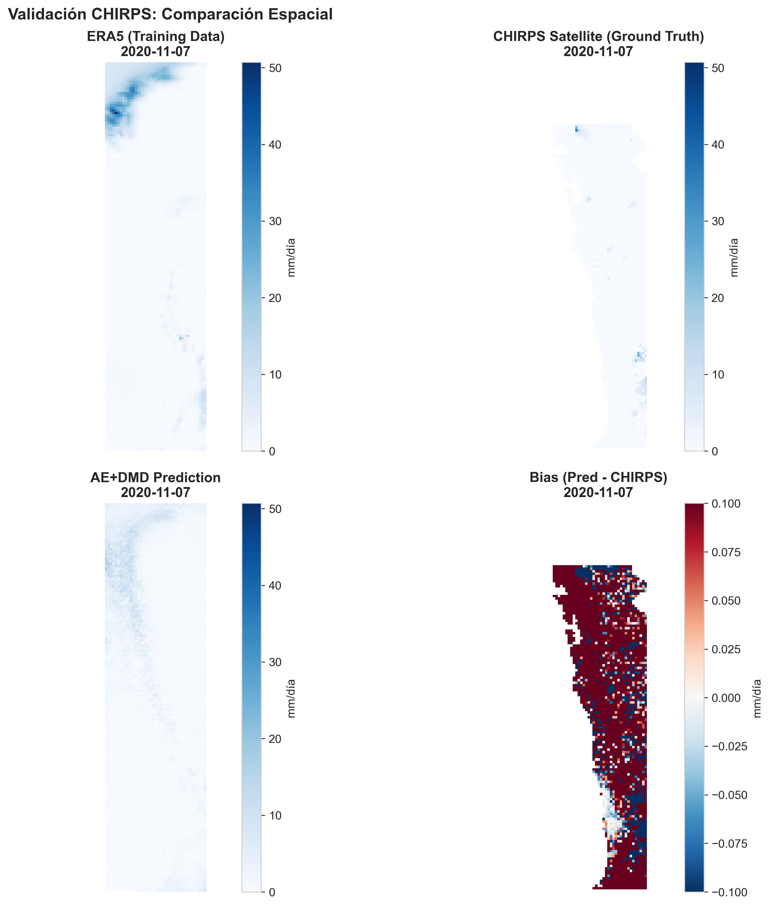
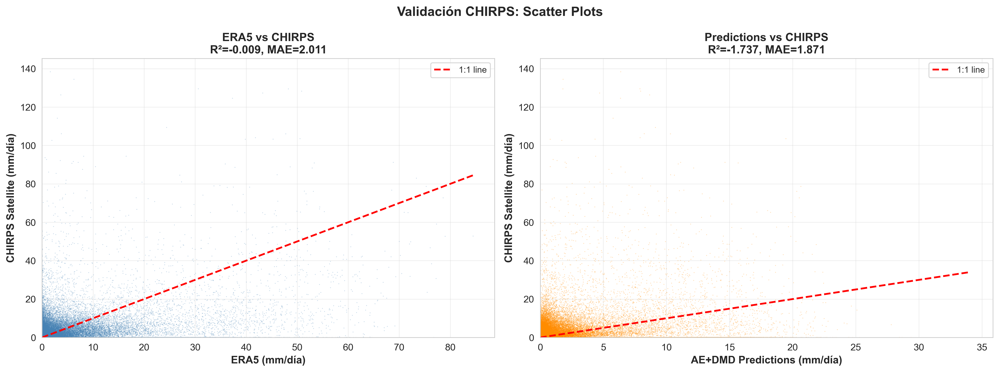
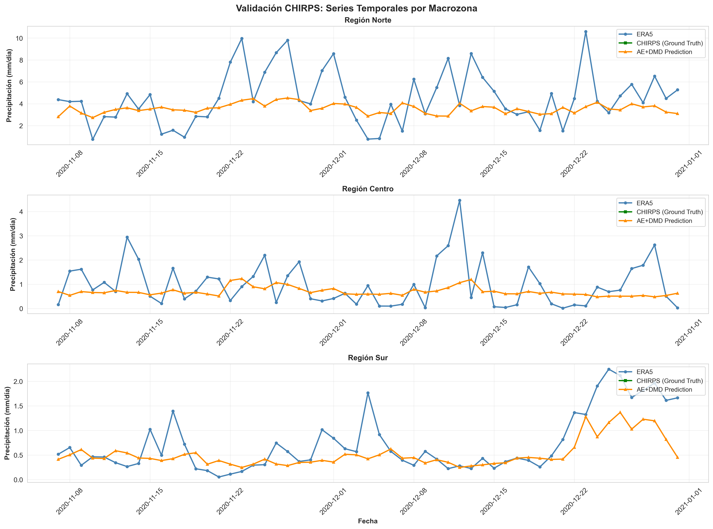

# Resumen Validación CHIRPS (2020 - test period)

## Métricas principales (global)
- ERA5 vs CHIRPS: MAE=2.011, RMSE=5.640, R2=-0.009, Bias=0.942
- Modelo vs CHIRPS: MAE=1.871, RMSE=4.466, R2=-1.737, Bias=0.333

## Métricas por umbral (eventos)
- Umbral gt_1mm:
  - ERA5 vs CHIRPS: POD=0.537, FAR=0.843, CSI=0.138, bias_cat=3.424
  - Modelo vs CHIRPS: POD=0.387, FAR=0.905, CSI=0.082, bias_cat=4.086
- Umbral gt_5mm:
  - ERA5 vs CHIRPS: POD=0.442, FAR=0.895, CSI=0.092, bias_cat=4.220
  - Modelo vs CHIRPS: POD=0.226, FAR=0.936, CSI=0.053, bias_cat=3.516

## Métricas por macrozona
- Norte: ERA5 vs CHIRPS: MAE=3.649, RMSE=8.275, R2=0.095 | Model vs CHIRPS: MAE=3.048, RMSE=5.727, R2=-0.755
- Centro: ERA5 vs CHIRPS: MAE=1.438, RMSE=4.411, R2=-0.354 | Model vs CHIRPS: MAE=1.569, RMSE=4.262, R2=-9.575
- Sur: ERA5 vs CHIRPS: MAE=1.348, RMSE=4.030, R2=-0.428 | Model vs CHIRPS: MAE=1.232, RMSE=3.283, R2=-4.758

## Figuras

